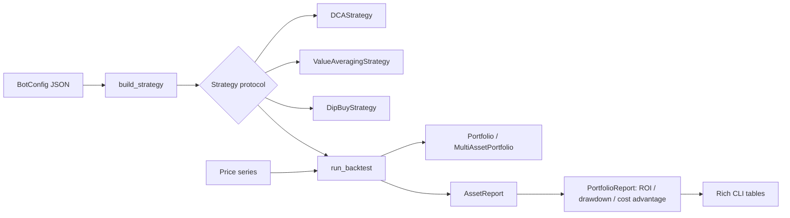

<p align="center">
  
</p>

<h1 align="center">DCA Bot</h1>

<p align="center">
  <strong>Dollar-cost averaging, value averaging &amp; dip-buying — backtested across a multi-asset portfolio, in Python.</strong><br>
  Buy on a cadence, buy harder on dips, target a growing value, track your real cost basis, and measure ROI &amp; drawdown.
</p>

<p align="center">
  <em>Built and maintained by <a href="https://viprasol.com">Viprasol Tech</a> — Fintech Experts. Full-Stack Builders.</em>
</p>

<p align="center">
  <a href="https://github.com/Viprasol-Tech/dca-bot/actions/workflows/ci.yml"></a>
  <a href="LICENSE"></a>
  
  
  
  
  <a href="https://t.me/viprasol_help"></a>
  <a href="https://github.com/Viprasol-Tech/dca-bot/stargazers"></a>
</p>

---

> ## ⚠️ Disclaimer
> This software is for **educational purposes only** and is **not financial advice**. Trading is highly volatile and involves substantial risk, including the **total loss of capital**. Backtest results are **not** indicative of future performance. Always validate on historical data first and comply with your local laws. **Use at your own risk** — Viprasol Tech assumes no responsibility for your trading results.

---

## ✨ Features

- 💵 **Dollar-cost averaging** — buy a fixed quote amount every `interval` ticks, regardless of price.
- 📈 **Value averaging** — target a portfolio value that grows by a fixed step each interval; buy *more* on dips and *less* on spikes (with an optional per-buy cap).
- 🩸 **Dip-buying** — scale every buy up in proportion to the drawdown from the running high, so you accumulate faster when the market is down.
- 🧺 **Multi-asset portfolios** — track many symbols at once with per-asset cost basis, value, PnL and value-weighted allocations.
- 📊 **Performance reports** — average cost vs. market price, **cost advantage**, ROI and **max drawdown**, rolled up into one capital-weighted summary.
- 🧾 **Typed config** — declare your assets and strategies in JSON, validated by pydantic; `init-config` writes a ready-to-edit example.
- 🖥️ **Rich CLI** — `demo`, `backtest`, `report`, `init-config`, `version` — all keyless and risk-free on synthetic data.
- ⚙️ **Modern tooling** — ruff, mypy (strict), pytest (55 tests), GitHub Actions CI.

## 🚀 Quickstart

```bash
git clone https://github.com/Viprasol-Tech/dca-bot.git
cd dca-bot
python -m pip install -e ".[dev]"

# Run a DCA backtest on synthetic data:
dca-bot demo --interval 10 --quote-amount 250

# Try the dip-buy strategy:
dca-bot backtest --strategy dip-buy --amount 100 --symbol BTC

# Scaffold a multi-asset config, then report on the whole portfolio:
dca-bot init-config --path dca-config.json
dca-bot report --config dca-config.json
```

## 🧩 Use it in code

### Compare strategies on one series

```python
from dca_bot import build_strategy, report_strategy

prices = [100.0, 80.0, 120.0, 90.0, 110.0]

for kind in ("dca", "value-averaging", "dip-buy"):
    strat = build_strategy(kind, amount=100.0, interval=1)
    r = report_strategy("BTC", strat, prices)
    print(f"{r.strategy:>16}  avg=${r.average_cost:7.2f}  ROI={r.roi:+.2%}  maxDD={r.max_drawdown:.2%}")
```

### Backtest a multi-asset config

```python
from dca_bot import BotConfig, report_portfolio

config = BotConfig.load("dca-config.json")
prices = {
    "BTC": [...],  # your historical price series per symbol
    "ETH": [...],
    "SOL": [...],
}
report = report_portfolio(config, prices)

print(report.total_value, report.roi, report.worst_drawdown)
for asset in report.assets:
    print(asset.symbol, asset.average_cost, asset.cost_advantage)
```

### Track holdings directly

```python
from dca_bot import MultiAssetPortfolio

book = MultiAssetPortfolio()
book.buy("BTC", quote_amount=100.0, price=20_000.0)
book.buy("ETH", quote_amount=100.0, price=1_500.0)

prices = {"BTC": 25_000.0, "ETH": 1_800.0}
print(book.value(prices))          # mark-to-market across all holdings
print(book.unrealized_pnl(prices)) # aggregate PnL
print(book.weights(prices))        # value-weighted allocation per symbol
```

## 🏗️ Architecture



## 📚 Strategies &amp; API

| Component | Import | What it does |
|-----------|--------|--------------|
| `DCAStrategy` | `dca_bot.dca` | Fixed quote amount every `interval` ticks |
| `ValueAveragingStrategy` | `dca_bot.strategies` | Buys toward a linearly growing target value; optional `max_buy` cap |
| `DipBuyStrategy` | `dca_bot.strategies` | Scales buys by drawdown (`dip_multiplier`, `max_multiple`) |
| `build_strategy(kind, ...)` | `dca_bot.strategies` | Factory: `dca` / `value-averaging` / `dip-buy` (+ aliases) |
| `Portfolio` | `dca_bot.portfolio` | Single-asset units, cost basis, value, PnL |
| `MultiAssetPortfolio` | `dca_bot.portfolio` | Many symbols, aggregate value/PnL, allocation weights |
| `run_backtest(strategy, prices)` | `dca_bot.backtest` | Replays a strategy; reports units, avg cost, ROI, max drawdown |
| `report_strategy` / `report_portfolio` | `dca_bot.report` | Cost advantage, ROI &amp; drawdown per asset and rolled up |
| `BotConfig` / `AssetConfig` | `dca_bot.config` | Pydantic-validated JSON config |

### CLI subcommands

| Command | Purpose |
|---------|---------|
| `dca-bot demo` | DCA backtest on synthetic data |
| `dca-bot backtest` | Backtest one strategy with a full report |
| `dca-bot report --config FILE` | Backtest every asset in a config and roll up |
| `dca-bot init-config` | Write an example multi-strategy config |
| `dca-bot version` | Print the installed version |

## 🗺️ Roadmap

- [x] DCA strategy + cost-basis math
- [x] Portfolio accounting + backtest runner
- [x] Value-averaging and dip-buying variants
- [x] Multi-asset portfolios + capital-weighted reports
- [x] Max-drawdown and cost-advantage metrics
- [x] JSON config + CLI subcommands
- [ ] Real schedulers (cron / interval clock) for live execution
- [ ] Exchange adapters for live buys
- [ ] CSV / Parquet price ingestion for backtests

## ❓ FAQ

**Does this place real trades?** No. Everything runs against price series you supply (or synthetic data) — there are no exchange keys or live order routing yet.

**What's the difference between DCA, value averaging and dip-buying?** DCA spends the same amount every interval. Value averaging spends *whatever it takes* to hit a growing target value, so it buys more when prices fall. Dip-buying keeps DCA's cadence but multiplies each buy by how far the price is below its running high.

**What does "cost advantage" mean?** The percentage by which your average entry price undercuts the final market price — a positive number means your averaged-in cost basis is cheaper than buying everything at the end.

**Which Python versions are supported?** 3.11, 3.12 and 3.13.

## 🤝 Contributing

PRs welcome — see [CONTRIBUTING.md](CONTRIBUTING.md) and our [Code of Conduct](CODE_OF_CONDUCT.md). Run `ruff check .`, `mypy src` and `pytest` before opening a PR.

## Contact — Viprasol Tech Private Limited

- Website: [viprasol.com](https://viprasol.com)
- Email: [support@viprasol.com](mailto:support@viprasol.com)
- Telegram: [t.me/viprasol_help](https://t.me/viprasol_help) | WhatsApp: +91 96336 52112
- GitHub: [@Viprasol-Tech](https://github.com/Viprasol-Tech) | [LinkedIn](https://www.linkedin.com/in/viprasol/) | X [@viprasol](https://twitter.com/viprasol)

## License

[MIT](LICENSE) (c) 2025 Viprasol Tech Private Limited
