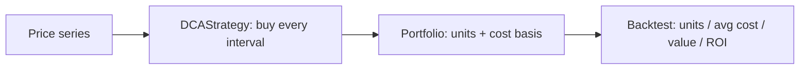

<p align="center">
  
</p>

<h1 align="center">DCA Bot</h1>

<p align="center">
  <strong>Dollar-cost-averaging (DCA) bot with scheduling and backtest — in Python.</strong><br>
  Buy a fixed amount on a fixed cadence, track your cost basis, and backtest the whole thing on a price series.
</p>

<p align="center">
  <em>Built and maintained by <a href="https://viprasol.com">Viprasol Tech</a> — Fintech Experts. Full-Stack Builders.</em>
</p>

<p align="center">
  <a href="https://github.com/Viprasol-Tech/dca-bot/actions/workflows/ci.yml"></a>
  <a href="LICENSE"></a>
  
  <a href="https://t.me/viprasol_help"></a>
  <a href="https://github.com/Viprasol-Tech/dca-bot/stargazers"></a>
</p>

---

> ## ⚠️ Disclaimer
> This software is for **educational purposes only** and is **not financial advice**. Trading is highly volatile and involves substantial risk, including the **total loss of capital**. Backtest results are **not** indicative of future performance. Always validate on historical data first and comply with your local laws. **Use at your own risk** — Viprasol Tech assumes no responsibility for your trading results.

---

## ✨ Features

- 💵 **DCA strategy** — buy a fixed quote amount every `interval` ticks, regardless of price.
- 📒 **Portfolio accounting** — track units, cost basis, and average price in one place.
- 🧮 **Cost-basis math** — `average_cost = total_spent / total_units`, verified by tests.
- 🔁 **Backtest runner** — replay DCA over a price series for units, avg cost, final value, and ROI.
- 🖥️ **CLI** — `dca-bot demo --interval 5 --quote-amount 100` runs the whole pipeline.
- ⚙️ **Modern tooling** — ruff, mypy (strict), pytest, GitHub Actions CI.

## 🚀 Quickstart

```bash
git clone https://github.com/Viprasol-Tech/dca-bot.git
cd dca-bot
python -m pip install -e ".[dev]"

# Run a DCA backtest on synthetic data:
dca-bot demo
dca-bot demo --interval 10 --quote-amount 250
```

## 🧩 Use it in code

```python
from dca_bot.dca import DCAStrategy
from dca_bot.backtest import run_backtest

prices = [10.0, 20.0, 50.0, 100.0]
strategy = DCAStrategy(quote_amount=100.0, interval=1)
result = run_backtest(strategy, prices)

print(result.total_units)    # units accumulated
print(result.average_cost)   # total_spent / total_units
print(result.final_value)    # marked to the last price
```

## 🏗️ Architecture



## 🗺️ Roadmap

- [x] DCA strategy + cost-basis math
- [x] Portfolio accounting + backtest runner
- [ ] Real schedulers (cron / interval clock) for live execution
- [ ] Exchange adapters for live buys
- [ ] Value-averaging and dip-buying variants

## 🤝 Contributing

PRs welcome — see [CONTRIBUTING.md](CONTRIBUTING.md) and our [Code of Conduct](CODE_OF_CONDUCT.md).

## Contact — Viprasol Tech Private Limited

- Website: [viprasol.com](https://viprasol.com)
- Email: [support@viprasol.com](mailto:support@viprasol.com)
- Telegram: [t.me/viprasol_help](https://t.me/viprasol_help) | WhatsApp: +91 96336 52112
- GitHub: [@Viprasol-Tech](https://github.com/Viprasol-Tech) | [LinkedIn](https://www.linkedin.com/in/viprasol/) | X [@viprasol](https://twitter.com/viprasol)

## License

[MIT](LICENSE) (c) 2025 Viprasol Tech Private Limited
